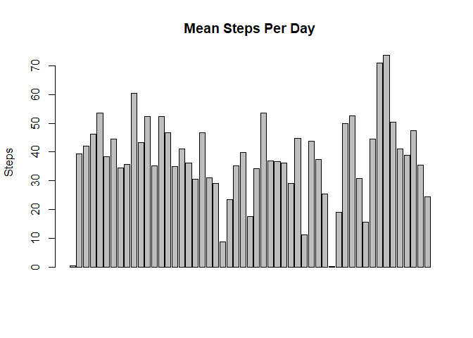
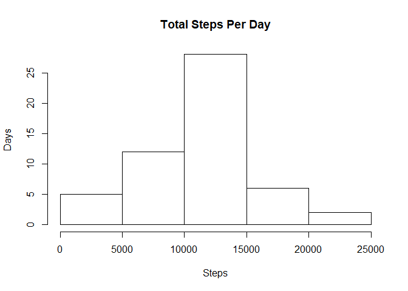
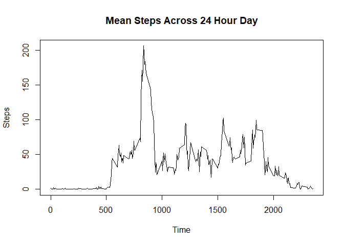
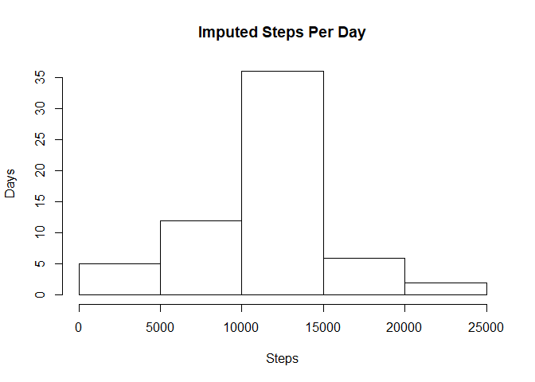
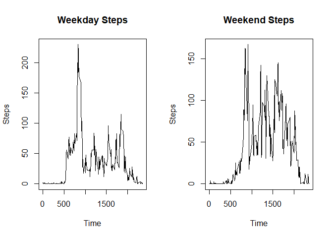

Loading and preprocessing the data
Show any code that is needed to

Load the data (i.e. \color{red}{\verb|read.csv()|}read.csv())
Process/transform the data (if necessary) into a format suitable for your analysis  
What is mean total number of steps taken per day?  
For this part of the assignment, you can ignore the missing values in the dataset.


```r
library(dplyr)
```

```
## Warning: package 'dplyr' was built under R version 3.6.3
```

```
## 
## Attaching package: 'dplyr'
```

```
## The following objects are masked from 'package:stats':
## 
##     filter, lag
```

```
## The following objects are masked from 'package:base':
## 
##     intersect, setdiff, setequal, union
```

```r
RawActivityData <- read.csv("activity.csv", stringsAsFactors = FALSE)
ValidActivityData <- na.omit(RawActivityData)
StepsPerDay <- data.frame(tapply(ValidActivityData$steps, ValidActivityData$date, mean))
StepsPerDay[2] <- rownames(StepsPerDay)
colnames(StepsPerDay) <- c("Mean_Steps_Per_Day", "Date")
rownames(StepsPerDay) <- NULL
barplot(unlist(na.omit(StepsPerDay[1])), xaxt = "n", ylab = "Steps", main = "Mean Steps Per Day")
```

<!-- -->

```r
NoNAStepsPerDaySummary <- summary(unlist(StepsPerDay[1]))
print(c("Mean Steps Per Day:",NoNAStepsPerDaySummary ))
```

```
##                                        Min.               1st Qu. 
## "Mean Steps Per Day:"   "0.142361111111111"    "30.6979166666667" 
##                Median                  Mean               3rd Qu. 
##    "37.3784722222222"    "37.3825995807128"    "46.1597222222222" 
##                  Max. 
##    "73.5902777777778"
```

Calculate the total number of steps taken per day  
If you do not understand the difference between a histogram and a barplot, research the difference between them. Make a histogram of the total number of steps taken each day  


```r
TotalStepsPerDay <- data.frame(tapply(ValidActivityData$steps, ValidActivityData$date, sum))
TotalStepsPerDay[2] <- rownames(TotalStepsPerDay)
colnames(TotalStepsPerDay) <- c("Mean_Steps_Per_Day", "Date")
rownames(TotalStepsPerDay) <- NULL
hist(unlist(na.omit(TotalStepsPerDay[1])), ylab = "Days", xlab = "Steps", main = "Total Steps Per Day")
```

<!-- -->

Calculate and report the mean and median of the total number of steps taken per day  

```r
print(c("Total Steps Per Day throwing out NAs:",summary(unlist(na.omit(TotalStepsPerDay[1])))))
```

```
##                                                                            Min. 
## "Total Steps Per Day throwing out NAs:"                                    "41" 
##                                 1st Qu.                                  Median 
##                                  "8841"                                 "10765" 
##                                    Mean                                 3rd Qu. 
##                      "10766.1886792453"                                 "13294" 
##                                    Max. 
##                                 "21194"
```

What is the average daily activity pattern?  
Make a time series plot (i.e. \color{red}{\verb|type = "l"|}type = "l") of the 5-minute interval (x-axis) and the average number of steps taken, averaged across all days (y-axis)  
Which 5-minute interval, on average across all the days in the dataset, contains the maximum number of steps?  
Imputing missing values    
Note that there are a number of days/intervals where there are missing values (coded as \color{red}{\verb|NA|}NA). The presence of missing days may introduce bias into some calculations or summaries of the data.

```r
StepsinTime <- data.frame(tapply(ValidActivityData$steps, ValidActivityData$interval, mean))
StepsinTime[2] <- as.numeric(rownames(StepsinTime))
rownames(StepsinTime) <- NULL
StepsinTime <- StepsinTime %>% rename(Mean_Steps = tapply.ValidActivityData.steps..ValidActivityData.interval..mean., Time = V2)
plot(y = unlist(na.omit(StepsinTime[1])), x = unlist(na.omit(StepsinTime[2])), xlab = "Time", ylab = "Steps", main = "Mean Steps Across 24 Hour Day", type = "l")
```

<!-- -->

```r
print(c("Maximum steps/interval and interval:",StepsinTime[which.max(unlist(StepsinTime[1])),]))
```

```
## [[1]]
## [1] "Maximum steps/interval and interval:"
## 
## $Mean_Steps
## [1] 206.1698
## 
## $Time
## [1] 835
```

The 5-minute interval that, on average, contains the maximum number of steps

```r
print(c("Interval with highest average steps",StepsinTime[which.max(StepsinTime$Mean_Steps),]))
```

```
## [[1]]
## [1] "Interval with highest average steps"
## 
## $Mean_Steps
## [1] 206.1698
## 
## $Time
## [1] 835
```

Calculate and report the total number of missing values in the dataset (i.e. the total number of rows with \color{red}{\verb|NA|}NAs)  

```r
MissingData <- is.na(RawActivityData$steps)
print("Number of NA values is")
```

```
## [1] "Number of NA values is"
```

```r
table(MissingData)["TRUE"] #RawActivityData is the entire data file, so this is it
```

```
## TRUE 
## 2304
```

Devise a strategy for filling in all of the missing values in the dataset. The strategy does not need to be sophisticated. For example, you could use the mean/median for that day, or the mean for that 5-minute interval, etc.  
Create a new dataset that is equal to the original dataset but with the missing data filled in.  

```r
# I chose to use mean imputation because it is easy, however it tends to reduce standard deviation and is not recommended.
IndexMissingData <- data.frame(MissingData,RawActivityData$interval,StepsinTime[1])
#So we made an Index of missing data. First column is T if the original data is NA. Second column is the interval
#Third column is the average steps for that interval. Here's the clever part - the average steps get repeated
#For each date (which we did not put in our index)
ReplacedActivityData <- RawActivityData
ReplacedActivityData[MissingData == TRUE,1] <- IndexMissingData[MissingData==TRUE,3] # replaces missing data with average value from that interval.
```
Make a histogram of the total number of steps taken each day and Calculate and report the mean and median total number of steps taken per day. Do these values differ from the estimates from the first part of the assignment? What is the impact of imputing missing data on the estimates of the total daily number of steps? 

```r
ReplacedStepsPerDay <- data.frame(tapply(ReplacedActivityData$steps, ReplacedActivityData$date, sum))
ReplacedStepsPerDay[2] <- rownames(ReplacedStepsPerDay)
colnames(ReplacedStepsPerDay) <- c("Mean_Steps_Per_Day", "Date")
rownames(ReplacedStepsPerDay) <- NULL
hist(unlist(ReplacedStepsPerDay[1]), ylab = "Days", xlab = "Steps", main = "Imputed Steps Per Day")
```

<!-- -->

```r
print(c("Total steps per day with imputed values", summary(ReplacedStepsPerDay[1]), "SD", sd(unlist(ReplacedStepsPerDay[1]))))
```

```
## [1] "Total steps per day with imputed values"
## [2] "Min.   :   41  "                        
## [3] "1st Qu.: 9819  "                        
## [4] "Median :10766  "                        
## [5] "Mean   :10766  "                        
## [6] "3rd Qu.:12811  "                        
## [7] "Max.   :21194  "                        
## [8] "SD"                                     
## [9] "3974.39074599954"
```

```r
print(c("Total Steps per day with NA removed", summary(TotalStepsPerDay[1]), "SD", sd(unlist(TotalStepsPerDay[1]))))
```

```
## [1] "Total Steps per day with NA removed" "Min.   :   41  "                    
## [3] "1st Qu.: 8841  "                     "Median :10765  "                    
## [5] "Mean   :10766  "                     "3rd Qu.:13294  "                    
## [7] "Max.   :21194  "                     "SD"                                 
## [9] "4269.18049268242"
```

```r
# Measurements of the mean are the same, which makes sense, but the standard deviation is higher when you don't impute values by mean impution.
```
Are there differences in activity patterns between weekdays and weekends?  
For this part the \color{red}{\verb|weekdays()|}weekdays() function may be of some help here. Use the dataset with the filled-in missing values for this part.  
Create a new factor variable in the dataset with two levels – “weekday” and “weekend” indicating whether a given date is a weekday or weekend day.  
Make a panel plot containing a time series plot (i.e. \color{red}{\verb|type = "l"|}type = "l") of the 5-minute interval (x-axis) and the average number of steps taken, averaged across all weekday days or weekend days (y-axis). See the README file in the GitHub repository to see an example of what this plot should look like using simulated data.  

```r
DayNameActivityData <- ReplacedActivityData
DayNameActivityData$Day_Of_Week <- weekdays(as.Date(unlist(DayNameActivityData[2])))

WeekendActivityData <- filter(DayNameActivityData, Day_Of_Week == "Saturday" | Day_Of_Week == "Sunday")
WeekdayActivityData <- filter(DayNameActivityData, Day_Of_Week  != "Saturday" & Day_Of_Week != "Sunday")
WeekdaySteps <- data.frame(tapply(WeekdayActivityData$steps, WeekdayActivityData$interval, mean))

WeekdaySteps[2] <- as.numeric(rownames(WeekdaySteps))
rownames(WeekdaySteps) <- NULL
WeekdaySteps <- WeekdaySteps %>% rename(Mean_Steps = tapply.WeekdayActivityData.steps..WeekdayActivityData.interval.., Time = V2)
 
WeekendSteps <- data.frame(tapply(WeekendActivityData$steps, WeekendActivityData$interval, mean))
WeekendSteps[2] <- as.numeric(rownames(WeekendSteps))
rownames(WeekendSteps) <- NULL
WeekendSteps <- WeekendSteps %>% rename(Mean_Steps = tapply.WeekendActivityData.steps..WeekendActivityData.interval.., Time = V2)
par(mfrow = c(1,2))
#print(WeekdaySteps)
plot(y = WeekdaySteps$Mean_Steps, x = WeekdaySteps$Time , xlab = "Time", ylab = "Steps", main = "Weekday Steps", type = "l")
plot(y = WeekendSteps$Mean_Steps, x = WeekendSteps$Time , xlab = "Time", ylab = "Steps", main = "Weekend Steps", type = "l")
```

<!-- -->
